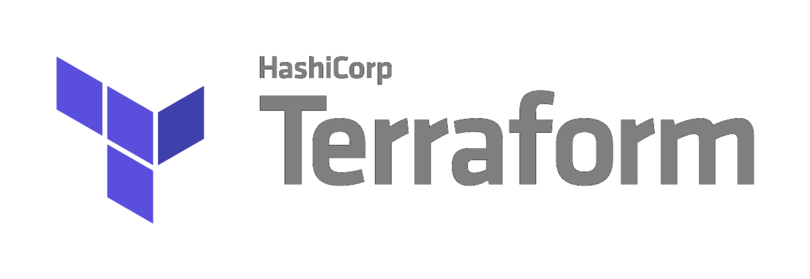

# terraform-labs




Terraform is an open-source infrastructure as code software tool that provides a consistent CLI workflow to manage hundreds of cloud services. Terraform codifies cloud APIs into declarative configuration files.

## Installation

First, install `terraform` easily with a package manager like `brew`: 

```sh
$ brew upgrade && brew install terraform
```

Since these labs are designed to run on Azure, you must install the `azure cli` command line tool.

```sh
$ brew upgrade && brew install azure-cli
```

## License

MIT License

See [LICENSE](https://github.com/aramirol/terraform-labs/blob/main/LICENSE) to see the full text.

